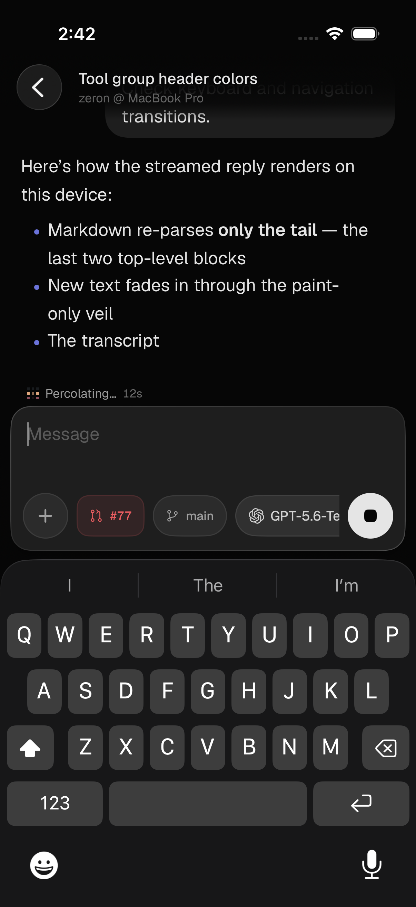
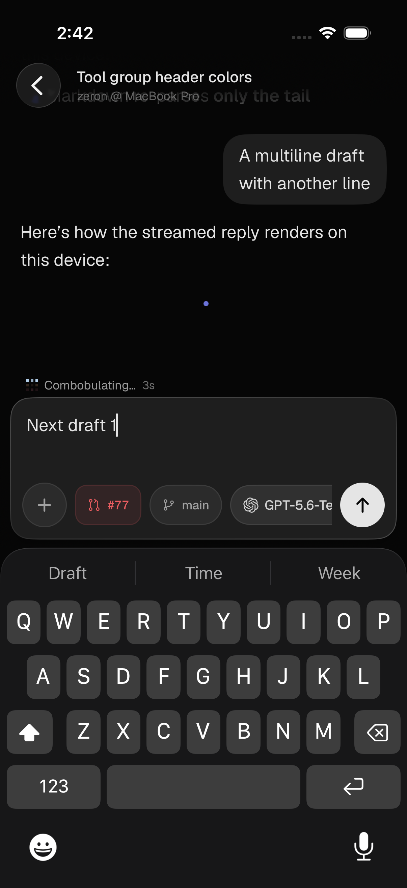
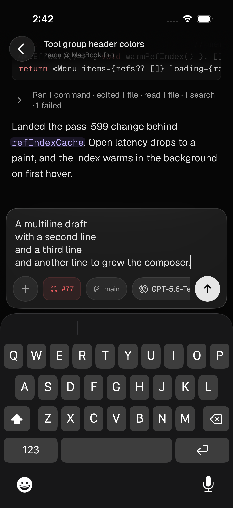
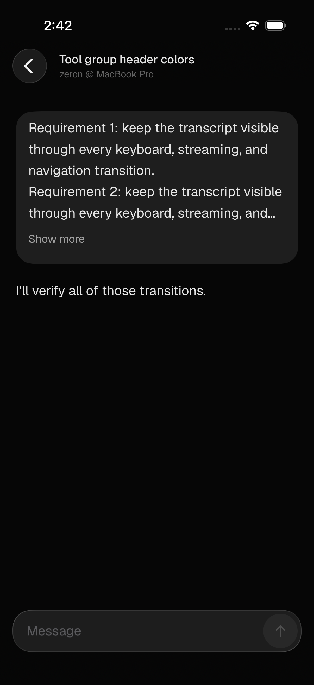
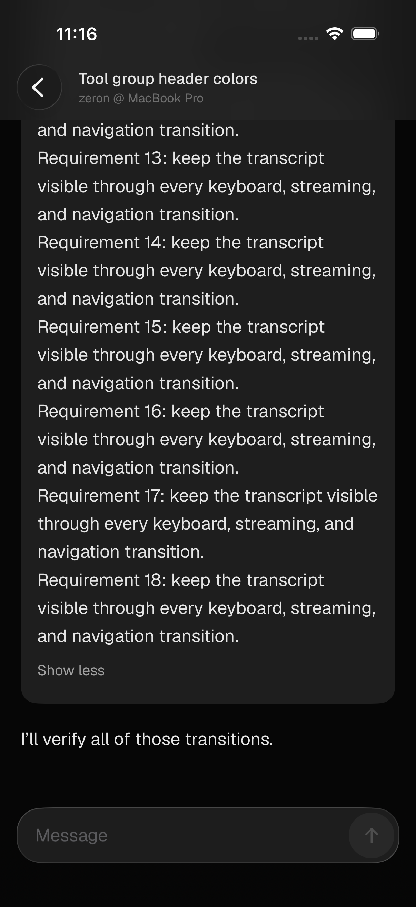
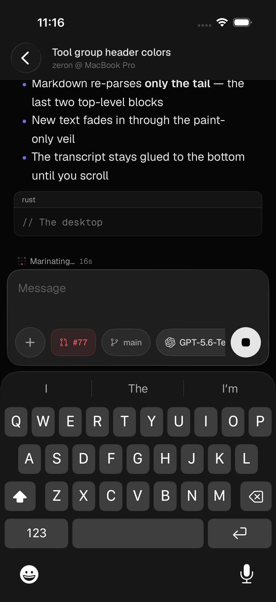
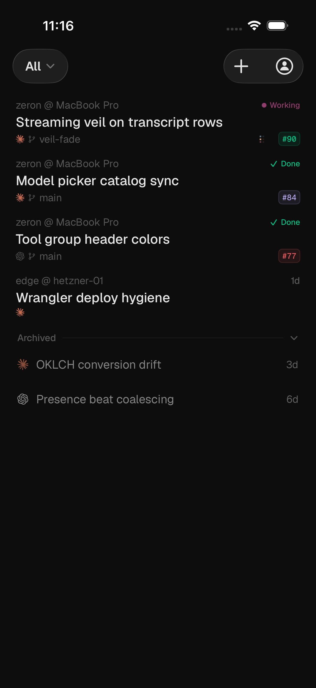
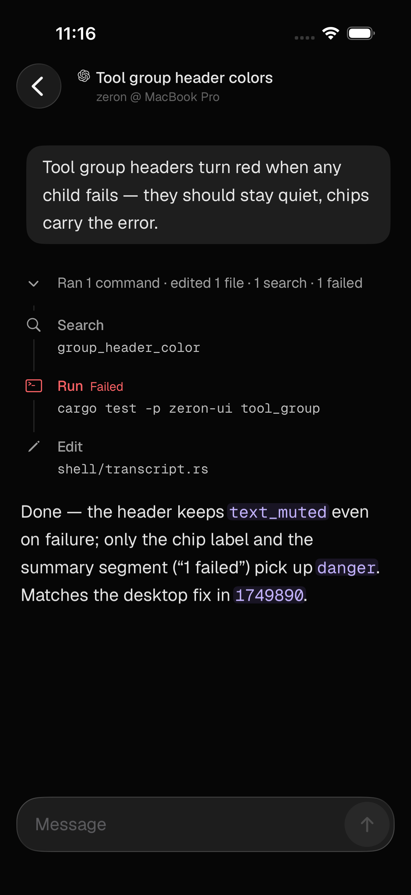
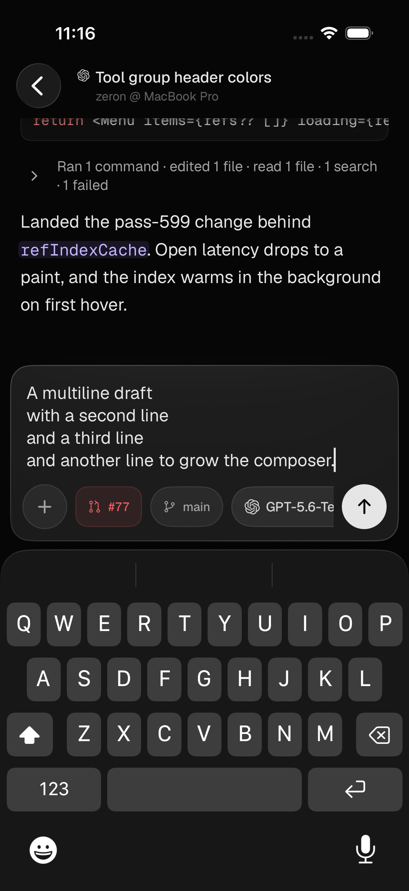

# Mobile transcript and interaction polish

The transcript uses a native `UITableView` for row reuse, height resolution,
scroll gestures, and animated offsets, with `UIHostingConfiguration` for the
existing SwiftUI message content. The earlier mixed lazy/eager layout passed
settled checks but still lost visible rows during rapid streaming and keyboard
resizes. A regression sampling those transitions at 90ms intervals reproduced
an absent tail while the old layout reported a bottom distance below 1pt.

Follow intent changes only on a real user drag, accessibility page navigation,
an explicit send/jump, or a user-message expansion. Keyboard and composer
resizing do not release it. The composer occupies sibling layout space so the
last row rests above it, while the transcript can draw outside its viewport
under the glass composer and fading header during scrolling. Compact
landscape uses a horizontal composer to preserve usable transcript space.

A local submission reserves one viewport beneath the prompt. The reply consumes
that space during layout; short completed replies keep it across warm session
navigation, including optimistic-message adoption. Long output naturally hands
over to following the tail. Remote user entries do not create a local runway.
Native scroll animation replaces delayed SwiftUI scroll-target retries; hosted
tests sample intermediate presentation offsets instead of only the end state.

The navigation bar has no material background. A noninteractive background-color
fade lies within the top safe area, so text disappears beneath the title. The
native table extends into that area and uses a top content inset to preserve its
resting position while keeping rows realized behind the bar. UIKit’s automatic
top-edge blur is disabled. User bubbles and their loading placeholders use
22pt continuous corners.

Existing streaming text starts fully visible when its row is reattached. Only
newly appended text fades, and the frame ticker stops after that fade settles.
This prevents revisiting a streaming row from briefly painting it black.

Long user messages have a five-line preview and Show more / Show less, with the
desktop's 400-character / five-line thresholds and measurement for wrapped text.
Expansion is retained in the warm session store and preserves the reading anchor.
The full text remains available to Copy. Controls have 44pt touch targets.

Accessibility exposes realized cells through a separate viewport container.
UIKit's default table proxies otherwise instantiate thousands of hosted rows
when inspecting a large history. VoiceOver page scrolling and Earlier/Later
messages actions expose adjacent pages without building the entire transcript.

The visual pass adopts Anara iOS's 17pt chat-body scale and larger secondary
labels, while retaining Zeron's Geist fonts and desktop palette. Code line
heights and list markers scale with Dynamic Type. Tool calls use the desktop
activity rail with quiet group summaries, per-tool failure labels, expandable
commands, and copy actions. Core composer and jump controls have 44pt targets
and explicit accessibility labels.

The project selector uses the native glass Menu button style. Applying glass
inside the Menu label allowed UIKit to restore a stale clipped label mask after
selection or dismissal. The menu itself now owns its glass surface and morph.

## Reproduce and test

```sh
DEVELOPER_DIR=/Applications/Xcode.app/Contents/Developer \
xcodebuild -project apps/ios/Zeron.xcodeproj -scheme Zeron \
  -destination 'platform=iOS Simulator,name=iPhone 17 Pro' test
```

`ZeronTests/TranscriptFollowTests` checks follow state independently of layout.
`ZeronTests/TranscriptLayoutTests` mounts the real SwiftUI transcript in a
simulator window and measures physical tail-row and viewport frames. Debug probes
are enabled only by these tests and compile to no-ops in release builds.

Coverage includes warm and delayed 600-turn histories, burst appends, a large
shrink, repeated warm reopens, composer/keyboard viewport changes, narrow and
landscape sizes, accessibility text resizing and paging, runway retention/overflow,
immediate history scrolling, and streaming during rapid keyboard resizes. A
header regression checks that actual cells remain realized above the safe-area
edge. The animation test also relays out the parent on every sample to catch
fractional-inset rounding that could otherwise cancel the native scroll.

For onscreen-keyboard checks, disconnect the hardware keyboard in Simulator’s
I/O → Keyboard menu for each device. If that connection is stale, reconnect and
disconnect it in the menu: XCTest typing can force the software keyboard open
even when ordinary editor taps would leave it hidden. The keyboard visibility
assertion catches that setup problem instead of silently testing only the composer.

`ZeronUITests/MobilePolishTests` exercises actual project selection/dismissal,
session navigation, scroll gestures, jump-to-latest, keyboard/composer changes,
tool disclosures, model picking, sending, question entry, new-session creation,
cancelled back swipes while streaming, user-message folding, and device rotation. Named screenshot
attachments are retained in the `.xcresult` bundle for visual review.

The follow-up passed 73 unit/hosted-layout tests and nine UI scenarios on both
iPhone 16e and iPhone 17 Pro (iOS 26.3.1 Simulator). The disclosure refinement was rerun on both devices. The header/squircle
follow-up then passed all 16 hosted-layout checks and five focused UI scenarios
on both sizes, with send/rotation and streaming/back-swipe checks repeated after
the fractional-inset animation fix. Streaming captures explicitly wait for a
hittable onscreen keyboard. A Release simulator build passed. Video
frames from three partial back swipes were also reviewed while the reply streamed.
The original 67-unit/six-UI pass did not cover the rapid transitions that exposed
these regressions; the added checks specifically exercise those transitions.

All interaction data is the offline demo dataset. This pass does not claim
physical-device performance, live host/edge delivery, or attachment transfer
coverage beyond the existing protocol tests.

## Streaming, keyboard motion, and draft clearing

Streaming chunks are registered with the row's fade clock before constructing
Text. Previously an appended suffix could paint opaque, then be registered by
`onChange` and darken on the next frame. Fade clocks now survive replacement of
a hosted cell and use monotonic time. Reopening the transcript still seeds
existing text as visible. Regression tests check first-render registration and
monotonic opacity across bursts and Markdown length changes. A block-append
regression also verifies that a chunk finishing a paragraph and starting a new
block refreshes both rows; inserting only the new row left the paragraph
without its final words until reuse.

The native table renders a screen-height area anchored to the bottom of the
logical transcript viewport. This keeps rows realized across the keyboard's
swept area. Its presentation position and runway offset share the viewport's
actual Core Animation springs and start times, including overlapping springs
when direction reverses; internal self-sizing layout runs
without a second animation. History resizing preserves a measured row anchor,
including when extra rows replace estimated heights. The header fade, glass
composer, and native animated send runway remain in place.

The composer uses one stable UITextView for selection, marked text, and keyboard
ownership. Sending commits composition, delivers the captured draft, and clears
that same native storage synchronously. A delayed delegate callback reads the
current storage instead of restoring the sent string. There is no asynchronous
second clear that could consume the next draft. Legacy attachment completion
clears only a draft still matching the submitted text.

Motion checks sample presentation frames every 16ms while the real keyboard
opens, closes, and rapidly reverses, while a short reply streams into a runway, and while reading
history. They assert relative anchor error below 4pt throughout the samples,
in addition to settled visibility. Controlled composer resizing reproduced a
44pt transient separation before the fix; the real-keyboard check reproduced
a roughly 300pt jump. These are simulator geometry measurements, not a claim
about physical-device frame rate or equivalence to another app.

Validation on iOS 26.3.1 Simulator: the final iPhone 17 Pro pass completed
83 unit/hosted-layout tests and all ten UI scenarios. The iPhone 16e full pass
completed 82 unit/layout tests and ten UI scenarios; after the paragraph fix,
all 27 affected unit/layout checks and the send and streaming/back-swipe UI
checks passed again. The stricter per-sample realization checks also passed on
both sizes. The 16e temporarily stopped responding to orientation requests;
a simulator restart restored rotation and two unchanged send/landscape runs
passed consecutively. Screenshots and streaming video frames were reviewed.
The arm64 Release simulator build passed.

| Streaming with keyboard open | Sent text cleared; next draft retained | Multiline composer |
| --- | --- | --- |
|  |  |  |

## Follow-up screenshots

| Five-line user preview | Expansion retained after reopening | Streaming with keyboard open |
| --- | --- | --- |
|  |  |  |

Additional captures: [text fading beneath the header](screenshots/mobile-transcript-recovery/header-fade.png),
[expanded text beneath the glass composer](screenshots/mobile-transcript-recovery/user-expanded.png),
[multiline composer](screenshots/mobile-transcript-recovery/multiline-composer.png),
[fast scrolling after reopen](screenshots/mobile-transcript-recovery/early-scroll.png), and
[cancelled back swipe](screenshots/mobile-transcript-recovery/cancelled-back-swipe.png), and
[a frame during a partial back swipe](screenshots/mobile-transcript-recovery/partial-back-swipe.png).

## Original visual pass captures

Simulator captures use the offline demo fixtures.

| Project selector after dismissal | Tool activity | Multiline composer |
| --- | --- | --- |
|  |  |  |

Additional captures: [project menu](screenshots/mobile-polish/project-menu.png),
[send runway](screenshots/mobile-polish/send-runway.png), and
[warm 600-turn reopen](screenshots/mobile-polish/warm-600-turns.png), and
[landscape keyboard](screenshots/mobile-polish/landscape-keyboard.png).
